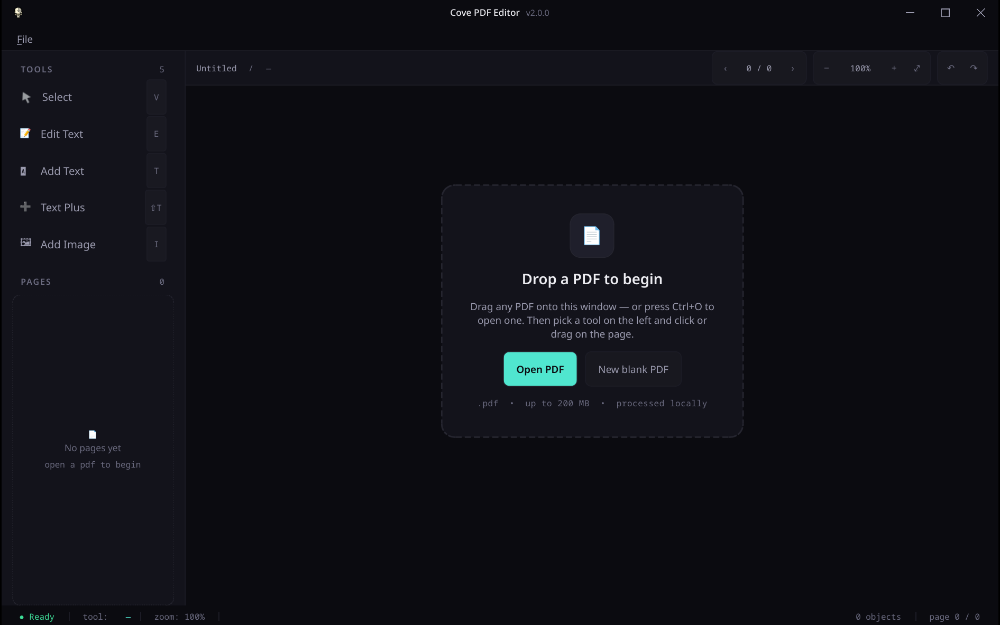

# Cove PDF Editor

A focused offline PDF editor for **Linux** and **Windows**. Edit
existing PDF text, add new text, drop images onto pages, save. Never
touches the cloud.



## Download (v2.0.0)
https://github.com/Sin213/cove-pdf-editor
| Platform | File |
| -------- | ---- |
| Windows (installer) | `Cove-PDF-Editor-2.0.0-Setup.exe` |
| Windows (portable) | `Cove-PDF-Editor-2.0.0-Portable.exe` |
| Linux (AppImage) | `Cove-PDF-Editor-2.0.0-x86_64.AppImage` |
| Linux (Debian / Ubuntu) | `Cove-PDF-Editor-2.0.0-amd64.deb` |

Grab the artifacts from the [Releases page](https://github.com/Sin213/cove-pdf-editor/releases).

## The flagship: Edit Text

**Double-click** any searchable text on the page. An inline editor opens
with the original text pre-filled and the detected font, size, bold,
and italic remembered. Hit Enter and the original glyphs are *removed*
from the PDF (not just visually covered) and replaced with your text in
the same place, at approximately the same font and size. This is the
"quick invoice fix" use case — not full multi-line paragraph reflow,
but it nails the common cases.

Works best on accounting-software / office PDFs with clean, searchable
text. Scanned PDFs need OCR first (use a separate tool like `cove-ocr`),
and some design-tool exports convert text to vector outlines which can't
be edited as text.

## Features

- **Open PDF** — local files only; drag-and-drop a PDF onto the window.
- **Page navigation** — sidebar page list.
- **Select** — click any added text or image to select; drag to move,
  drag the corner/edge handles to resize, **Delete** to remove,
  **Esc** to deselect.
- **Edit Text** — *double-click* any searchable text run; the original
  glyphs are removed and replaced in-place at the same approximate font
  and size. If the click misses any text, the status bar tells you.
- **Add Text** — drag a rectangle, type, **Enter** to commit. The new
  text box stays selectable, movable, resizable, and double-click
  re-editable.
- **Text Plus** — single-click anywhere to drop a small editable text
  entry. The tool stays active for repeated clicks — handy for filling
  print-only forms one field after another.
- **Add Image** — pick a PNG / JPG, drag a rectangle, the image stretches
  to fill it. Resizable / movable / deletable like a text object.
- **Formatting toolbar** — appears whenever a text object is selected:
  font family, size, bold, italic, underline, color, and alignment.
  Changes apply immediately; saved output preserves them.
- **Save** — bakes every edit into a clean PDF that opens in any reader.
  No annotation layer, no extra metadata, no cloud round-trips.

## Requirements

- No ML models. No internet at runtime.
- Python 3.10+ to run from source.

## Fonts

Cove's formatting toolbar shows a curated list of common text fonts —
the PDF base-14 (Helvetica, Times, Courier) plus standard cross-platform
fonts (Arial, Times New Roman, Calibri, Cambria, Georgia, Verdana,
Tahoma) and open-source families (Liberation, DejaVu, Noto, Carlito,
Caladea, Tinos, Cousine, Arimo). Friendly names are mapped to whatever
compatible family is actually installed on your system.

**Cove does not bundle proprietary Microsoft fonts.** For Microsoft
fonts on Linux, install them through your system package manager —
e.g. `ttf-ms-fonts` on Arch / EOS — subject to Microsoft's own
licensing terms. If the Microsoft font isn't installed, Cove
substitutes a metric-compatible open-source family (Liberation Sans
for Arial, Liberation Serif for Times New Roman, Carlito for Calibri,
Caladea for Cambria, etc.).

## Running from source

```bash
pip install -e .
cove-pdf-editor
```

Or without installing:

```bash
PYTHONPATH=src python -m cove_pdf_editor
```

## Building release artifacts

**Linux (AppImage + .deb):**
```bash
VERSION=2.0.1 ./scripts/build-release.sh
```
Outputs `release/Cove-PDF-Editor-<version>-x86_64.AppImage` and
`release/Cove-PDF-Editor-<version>-amd64.deb`. Requires `python`,
`curl`, `tar`, `xz`, `binutils` (`ar`), and `libfuse2` (for
appimagetool). The script downloads `appimagetool` to `~/.local/bin`
on first run.

**Windows (portable only) — local:**
```powershell
.\scripts\build_windows.ps1 -Version 2.0.1
```
Output: `release\Cove-PDF-Editor-2.0.1-Portable.exe`.
Requires Python 3.10+ on Windows.

**Windows (full — installer + portable) — local:**
```powershell
.\build.ps1 -Version 2.0.1
```
Outputs `release\Cove-PDF-Editor-2.0.1-Setup.exe` and
`release\Cove-PDF-Editor-2.0.1-Portable.exe`. Requires Python 3.10+
and [Inno Setup 6](https://jrsoftware.org/isdl.php).

**GitHub Actions (all four artifacts):** the `release` workflow
(`.github/workflows/release.yml`) runs `scripts/build-release.sh` on
`ubuntu-latest` and `build.ps1` on `windows-latest`, and emits matching
`.sha256` sidecars for every artifact.

- Push a `vX.Y.Z` tag → builds all four artifacts and attaches them
  (plus checksums) to a GitHub Release.
- Or run **Actions → release → Run workflow** and pass a `version`
  input → builds all four artifacts as workflow artifacts (no Release
  is created).

Every shipped binary has a sibling `<artifact>.sha256` produced with
standard `sha256sum` output format.

## Known limits

- No true in-place paragraph text editing. The Edit Text tool uses an
  overlay technique — works great for short replacements at the original
  font/size, doesn't reflow.
- No OCR for scanned PDFs (separate app).
- Font fallback: if the captured font name isn't in reportlab's standard
  set, we pick the closest visual match. Usually imperceptible; for
  exotic fonts you may see a slight style difference.
- "Edit text" works on a whole line at a time by default, not a single
  word. Select the whole line's worth of replacement text.

## License

MIT — see [LICENSE](LICENSE).
